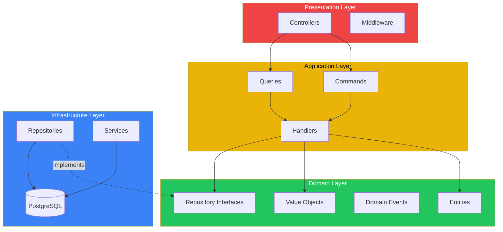

# TypeScript Bun Backend


> **Boilerplate de backend moderno e production-ready** usando Bun, TypeScript, Clean Architecture, DDD e CQRS.

Este projeto é um template completo para criar APIs RESTful robustas e escaláveis. Ele implementa as melhores práticas de arquitetura de software, padrões de projeto e segurança enterprise-grade.

---

## Quick Start

```bash
# 1. Clone o repositório
git clone https://github.com/seu-usuario/TypeScriptBunBackend.git
cd TypeScriptBunBackend

# 2. Instale as dependências
bun install

# 3. Configure o ambiente
cp .env.example .env

# 4. Inicie o PostgreSQL (Docker)
docker-compose up -d

# 5. Execute as migrations e inicie o servidor
bun run db:push && bun run dev
```

Acesse: **http://localhost:8702/swagger** para ver a documentação da API.

---

## Documentacao Completa

Esta documentacao esta organizada em modulos para facilitar a navegacao. Clique em cada secao para acessar o conteudo detalhado:

### Primeiros Passos

| Documento | Descricao |
|-----------|-----------|
| [**Getting Started**](./docs/readme/01-getting-started.md) | Guia completo de instalacao, configuracao do ambiente, VS Code, PostgreSQL e troubleshooting |
| [**Stack Tecnologica**](./docs/readme/02-stack.md) | Explicacao detalhada de cada tecnologia (Bun, Elysia, Drizzle, TypeScript) e por que foram escolhidas |

### Arquitetura e Padroes

| Documento | Descricao |
|-----------|-----------|
| [**Arquitetura**](./docs/readme/03-architecture.md) | Clean Architecture, DDD, CQRS, Bounded Contexts, Dependency Injection e diagramas completos |
| [**Padroes de Projeto**](./docs/readme/04-design-patterns.md) | Factory, Repository, Strategy, Observer, Result Monad e outros padroes implementados |

### Seguranca e Desenvolvimento

| Documento | Descricao |
|-----------|-----------|
| [**Seguranca**](./docs/readme/05-security.md) | JWT, rate limiting, hashing de senhas, headers de seguranca e checklist de protecoes |
| [**Tutorial: Nova Feature**](./docs/readme/06-feature-tutorial.md) | Estudo de caso completo implementando um CRUD de Tasks passando por todas as camadas |

### Operacoes

| Documento | Descricao |
|-----------|-----------|
| [**Deployment**](./docs/DEPLOYMENT.md) | Deploy com Docker, VPS, Nginx, SSL e systemd |
| [**Runbook**](./docs/RUNBOOK.md) | Operacoes do dia-a-dia, monitoramento, troubleshooting e emergencias |
| [**Seguranca Operacional**](./docs/SECURITY.md) | Resposta a incidentes, gestao de secrets e procedimentos |

### Decisoes Arquiteturais

| ADR | Descricao |
|-----|-----------|
| [**ADR-001**](./docs/ADR/001-bun-runtime.md) | Por que escolhemos Bun como runtime |
| [**ADR-002**](./docs/ADR/002-clean-architecture.md) | Por que Clean Architecture |
| [**ADR-003**](./docs/ADR/003-sqlite-database.md) | Decisao inicial SQLite (migrado para PostgreSQL) |
| [**ADR-004**](./docs/ADR/004-cqrs-pattern.md) | Por que CQRS |

---

## Features Principais

### Arquitetura
- **Clean Architecture** - 4 camadas bem definidas com regra de dependencia
- **Domain-Driven Design** - Entities, Value Objects, Domain Events, Bounded Contexts
- **CQRS** - Separacao de Commands (escrita) e Queries (leitura)
- **Dependency Injection** - Container manual sem bibliotecas externas

### Seguranca
- **JWT Dual-Token** - Access token (15min) + Refresh token (7 dias) com rotacao
- **Argon2id** - Hashing de senhas via `Bun.password`
- **Rate Limiting** - Protecao contra brute force por endpoint
- **Security Headers** - HSTS, CSP, X-Frame-Options e mais

### Developer Experience
- **Type-Safety End-to-End** - TypeScript strict mode em todas as camadas
- **Hot Reload** - `bun --watch` para desenvolvimento agil
- **Swagger/OpenAPI** - Documentacao automatica em `/swagger`
- **Testes** - Vitest + Bun test para unit, integration e E2E

### Observabilidade
- **Request ID Tracing** - UUID v7 em todas as requisicoes
- **Metricas Prometheus** - Endpoint `/metrics` pronto para scraping
- **Health Checks** - `/health` para orquestracao

---

## Scripts Disponiveis

| Comando | Descricao |
|---------|-----------|
| `bun run dev` | Inicia servidor com hot reload |
| `bun run start` | Inicia servidor em modo producao |
| `bun run build` | Gera build otimizado em `./dist` |
| `bun run type-check` | Verifica tipos sem compilar |
| `bun run db:generate` | Gera migrations do Drizzle |
| `bun run db:push` | Aplica schema no banco |
| `bun run db:studio` | Abre Drizzle Studio (GUI) |
| `bun run test` | Executa testes com Vitest |
| `bun run test:bun` | Executa testes com Bun test |
| `bun run test:all` | Executa todos os testes |

---

## Estrutura de Diretorios

```
src/
├── contexts/                    # Bounded Contexts (DDD)
│   └── auth/                    # Contexto de Autenticacao
│       ├── domain/              # Entidades, Value Objects, Events
│       ├── application/         # Commands, Queries, Handlers
│       ├── infrastructure/      # Repositories, Services
│       └── presentation/        # Controllers, Middleware
├── shared/                      # Kernel Compartilhado
│   ├── domain/                  # Classes base (Entity, ValueObject)
│   ├── application/             # Interfaces de handlers
│   └── infrastructure/          # Middleware, DB, Crypto
└── infrastructure/
    ├── di/                      # Container de DI
    └── database/                # Conexao e migrations

docs/
├── readme/                      # Documentacao detalhada
├── ADR/                         # Architecture Decision Records
├── DEPLOYMENT.md                # Guia de deploy
├── RUNBOOK.md                   # Operacoes
└── SECURITY.md                  # Seguranca operacional
```

---

## Diagrama de Arquitetura



---

## Requisitos de Sistema

| Requisito | Versao Minima |
|-----------|---------------|
| **Bun** | 1.2.21+ |
| **PostgreSQL** | 14+ |
| **Node.js** (opcional) | 18+ (para algumas ferramentas) |
| **Docker** (opcional) | 20+ |

---

## Contribuindo

1. Faca um Fork do projeto
2. Crie sua Feature Branch (`git checkout -b feature/MinhaFeature`)
3. Commit suas mudancas (`git commit -m 'feat: Adiciona MinhaFeature'`)
4. Push para a Branch (`git push origin feature/MinhaFeature`)
5. Abra um Pull Request

Veja o [tutorial de nova feature](./docs/readme/06-feature-tutorial.md) para entender como adicionar funcionalidades seguindo a arquitetura.

---

## Licenca

Este projeto esta sob a licenca MIT. Veja o arquivo [LICENSE](./LICENSE) para mais detalhes.

---

## Links Uteis

- [Documentacao do Bun](https://bun.sh/docs)
- [Documentacao do Elysia](https://elysiajs.com/)
- [Documentacao do Drizzle ORM](https://orm.drizzle.team/)
- [Clean Architecture - Uncle Bob](https://blog.cleancoder.com/uncle-bob/2012/08/13/the-clean-architecture.html)
